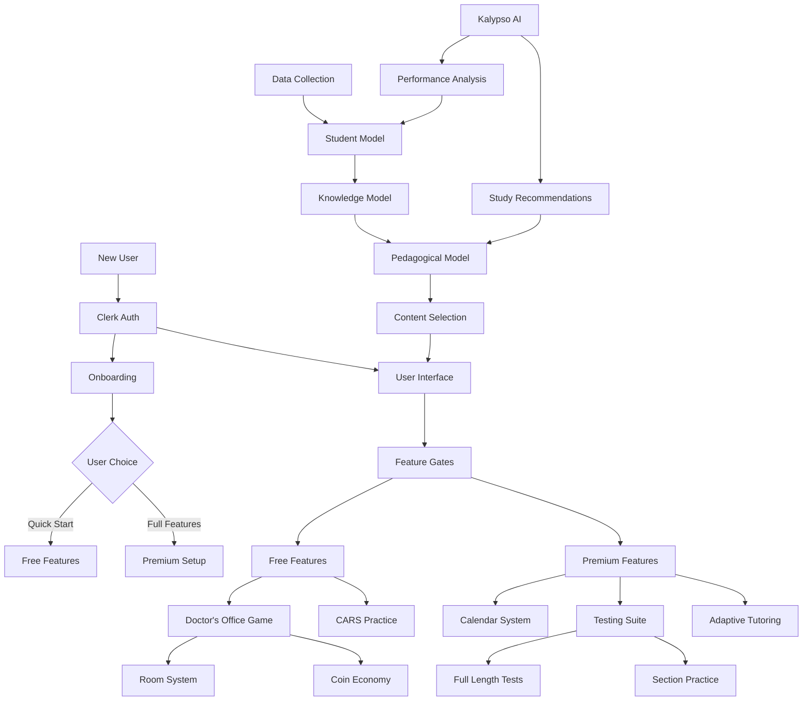

## Core Components

### 1. Frontend (Next.js App)
- **UI Framework**: Next.js 13+ with App Router
- **Styling**: Tailwind CSS + Shadcn components
- **State Management**: React hooks + Context

### 2. Backend Services
- **Database**: PlanetScale (MySQL) via Prisma ORM
- **Authentication**: Clerk.dev
- **AI Services**: OpenAI API
- **Payments**: Stripe

### 3. Core Modules



### 4. Key Subsystems

#### a. Doctor's Office Game
- Gamified learning environment
- Room/Subject unlocking system
- Patient scoring mechanism
- Coin-based economy

#### b. Testing System
- Full-length MCAT exams
- Section-specific practice
- Performance analytics
- Score tracking and predictions

#### c. Knowledge Engine
- Question bank management
- Content categorization
- Difficulty scaling
- Performance tracking

#### d. AI Integration
- Kalypso (AI tutor)
- Performance analysis
- Personalized feedback
- Study recommendations

## Data Flow Architecture

1. **User Interactions**
   - Practice questions
   - Full-length tests
   - Game activities
   - Flashcard responses

2. **Data Processing**
   ```
   User Action → Data Pulse → Knowledge Update → Content Selection
   ```

3. **Feedback Loops**
   - Performance tracking
   - Difficulty adjustment
   - Content recommendations
   - Study plan updates
