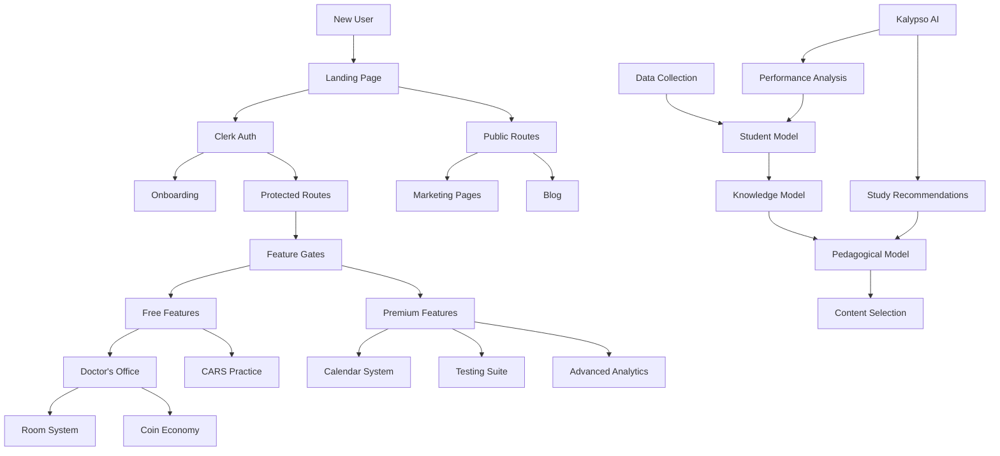

# MYMCAT System Architecture

```mermaid
graph TD
    Start[New User] --> Landing[Landing Page]
    Landing --> Auth[Clerk Auth]
    Auth --> Onboard[Onboarding]
    
    Landing --> PublicRoutes[Public Routes]
    PublicRoutes --> Marketing[Marketing Pages]
    PublicRoutes --> Blog[Blog]
    
    Auth --> ProtectedRoutes[Protected Routes]
    ProtectedRoutes --> FeatureGates[Feature Gates]
    
    FeatureGates --> Free[Free Features]
    FeatureGates --> Premium[Premium Features]
    
    Free --> Game[Doctor's Office]
    Free --> CARS[CARS Practice]
    
    Premium --> Calendar[Calendar System]
    Premium --> Testing[Testing Suite]
    Premium --> Analytics[Advanced Analytics]
    
    Game --> RoomSystem[Room System]
    Game --> CoinEconomy[Coin Economy]
    
    DataCollection[Data Collection] --> StudentModel[Student Model]
    StudentModel --> KnowledgeModel[Knowledge Model]
    KnowledgeModel --> PedagogicalModel[Pedagogical Model]
    PedagogicalModel --> ContentSelection[Content Selection]
    
    KalypsoAI[Kalypso AI] --> Analysis[Performance Analysis]
    KalypsoAI --> Recommendations[Study Recommendations]
    Analysis --> StudentModel
    Recommendations --> PedagogicalModel
```