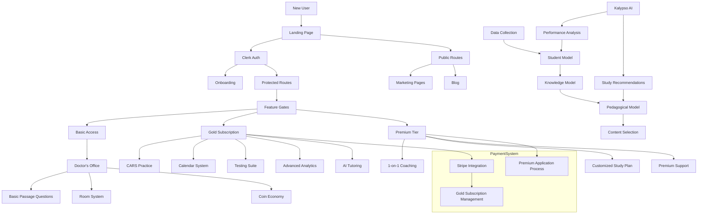

# MYMCAT System Architecture

```mermaid
graph TD
    Start[New User] --> Landing[Landing Page]
    Landing --> Auth[Clerk Auth]
    Auth --> Onboard[Onboarding]
    Landing --> PublicRoutes[Public Routes]
    PublicRoutes --> Marketing[Marketing Pages]
    PublicRoutes --> Blog[Blog]
    Auth --> ProtectedRoutes[Protected Routes]
    ProtectedRoutes --> FeatureGates[Feature Gates]
FeatureGates --> Basic[Basic Access]
FeatureGates --> Gold[Gold Subscription]
FeatureGates --> Premium[Premium Tier]
Basic --> Game[Doctor's Office]
    Game --> PassageQuestions[Basic Passage Questions]
    Game --> RoomSystem[Room System]
    Game --> CoinEconomy[Coin Economy]
Gold --> CARS[CARS Practice]
Gold --> Calendar[Calendar System]
Gold --> Testing[Testing Suite]
Gold --> Analytics[Advanced Analytics]
Gold --> AITutoring[AI Tutoring]
Premium --> PersonalizedCoaching[1-on-1 Coaching]
Premium --> CustomizedPlan[Customized Study Plan]
Premium --> PremiumSupport[Premium Support]
    DataCollection[Data Collection] --> StudentModel[Student Model]
    StudentModel --> KnowledgeModel[Knowledge Model]
    KnowledgeModel --> PedagogicalModel[Pedagogical Model]
    PedagogicalModel --> ContentSelection[Content Selection]
    KalypsoAI[Kalypso AI] --> Analysis[Performance Analysis]
    KalypsoAI --> Recommendations[Study Recommendations]
    Analysis --> StudentModel
    Recommendations --> PedagogicalModel
subgraph PaymentSystem
StripeIntegration[Stripe Integration]
GoldSubscription[Gold Subscription Management]
PremiumApplication[Premium Application Process]
end
Gold --> StripeIntegration
Premium --> PremiumApplication
StripeIntegration --> GoldSubscription
```