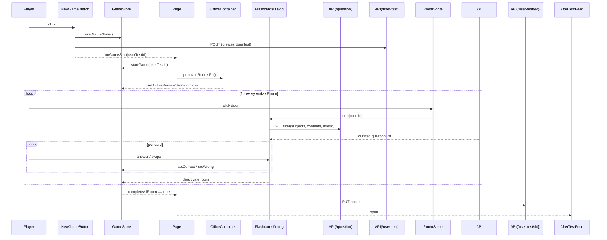
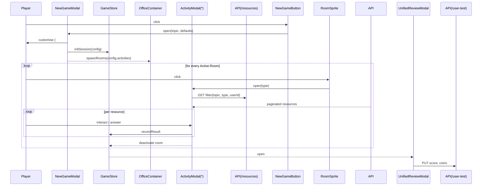

# Game Loop Overview
# Game Loop Evolution – Before & After

This document compares the **current flashcard-only game loop** (BEFORE) with the **target multi-activity system** (AFTER) and provides a concrete migration roadmap.

## BEFORE – Current Flashcard-Only Loop

This document walks through the **runtime flow** of a Doctor's Office session – from the moment the
user taps **New Game** through room activation, flashcard delivery and final scoring.  
Use it as an architectural map when you need to trace data or add new gameplay features.

---

## 1. Sequence Diagram (High-level)


```

---

## 2. Starting a New Game

File
• `app/(dashboard)/(routes)/ankiclinic/components/NewGameButton.tsx`

Key steps:
1. **Coin Check** – verifies the user has ≥ 1 coin; otherwise a toast is shown.  
2. **Debit Coin** – `useUserInfo().decrementScore()`.
3. **Reset Local Store** – `useGame().resetGameState()` clears any leftover session data.
4. **Create UserTest** – `POST /api/user-test` records a fresh test row and returns `userTestId`.
5. **Callback** – invokes the `onGameStart(userTestId)` prop supplied by `page.tsx`.

---

## 3. Room Selection & Activation

### 3.1 Passing the *populateRooms* callback
• `OfficeContainer.tsx` exposes `populateRooms()` via its `onNewGame` prop.  
• `page.tsx` captures this reference so the page can ask *"pick rooms for me"* when the
  user actually starts.

```typescript
// page.tsx
const handleSetPopulateRooms = (fn: () => GridImage[]) => setPopulateRoomsFn(() => fn);
```

### 3.2 Algorithm (`OfficeContainer.populateRooms()`)
File: `app/(dashboard)/(routes)/ankiclinic/OfficeContainer.tsx`
1. Fetch **availableRooms** from the current level's config (excluding tutorial WaitingRoom).  
2. Shuffle and slice **4** rooms.  
3. `setActiveRooms(new Set(roomIds))` inside the global `useGame` slice.  
4. Return the chosen `GridImage[]` so the calling layer can show a toast summary.

> Room subjects/content come from the lookup maps `roomToSubjectMap` and `roomToContentMap`.

### 3.3 Visible vs. Active
* **visibleImages** – everything mounted on the Pixi stage for the user's current building level.  
* **activeRooms** – subset of rooms that are clickable this run. When a room is cleared it is
  removed from this Set.

---

## 4. Flashcard Flow per Room

### 4.1 Door → Dialog
`RoomSprite` (Pixi `<Sprite>` wrapper) detects a click on its **question-mark bubble**:  
```ts
setFlashcardRoomId(img.id);
audio.playSound('flashcard-door-open');
setIsFlashcardsOpen(true);
```
The global store now knows which room is open (`flashcardRoomId`) and React renders
`<FlashcardsDialog />`.

### 4.2 Fetching Questions
File: `FlashcardDeck.tsx → fetchFlashcards()`
1. Resolve arrays of **subjects** and **contents** from the room maps.
2. Build query string and GET `/api/question` with:
   • `subjectCategory[]=…`, `contentCategory[]=…`, `types=flashcard,normal` etc.
3. The API pipeline (`app/api/question/route.ts` → `lib/question.ts`) …
   • Joins **KnowledgeProfile** data for the current user.  
   • Applies hard filters (recently-seen, answered-correct, etc.).  
   • Computes soft weights using mastery & incorrect-streak for probabilistic sampling.  
   Thus **knowledge profiles directly shape the deck** so weaker areas surface first.

### 4.3 Answering & Scoring
* MCQs and basic flashcards share the same swipe/keyboard hooks.  
* `onCorrectAnswer` / `onWrongAnswer` update both component local state and
  `useGame`'s `correctCount` / `wrongCount`.
* After the last active room closes, `setCompleteAllRoom(true)` flags the session as done.

---

## 5. Session Completion

`page.tsx` watches:
```ts
if (completeAllRoom && currentUserTestId) finishTest();
```
`finishTest()`
1. Fetches final `UserResponse`s for the test.
2. Calculates **score**: `+1` per correct, `-0.5` per wrong (no negatives).
3. `PUT /api/user-test/{id}` to persist score & `finishedAt`.
4. Opens **AfterTestFeed** modal for feedback & rewards.

---

## 6. Sprite Logic (Kalypso)

* Located in `OfficeContainer.tsx` as `AnimatedSpriteWalking` (Pixi-JS spritesheet slicing).
* Walks along `spriteWaypoints[level]` – each building level unlocks a longer path.
* Uses `setInterval(70ms)` to nudge position; direction sets the correct spritesheet column.
* `onClick` is forwarded to parent; currently used to launch the Kalypso chatbot.

---

## 7. Key Global Store (`/store/slices/gameSlice.ts` via selectors)
Not exhaustive – but the core fields that drive the loop:
* `isGameInProgress` – toggles UI enable/disable.
* `activeRooms: Set<string>` – which rooms are clickable.
* `flashcardRoomId` – current open room.
* `correctCount / wrongCount` – populated during play.
* `completeAllRoom` – triggers scoring flow.

---

## 8. Extending the Loop
When adding new mechanics:
1. Extend `levelConfigurations` & `roomToSubjectMap`.
2. Ensure the room's subject/content have KnowledgeProfiles so question curation works.
3. Export selectors per **State Management Patterns** rule.
4. Add UI hooks in `FlashcardDeck` if answer types change.

---

## 9. Room → Subject / Content Mapping Internals

**Why it matters:** this table is the bridge between the visual clinic (rooms/sprites) and the adaptive engine (Knowledge-Profile-driven question picker). Any new room, subject, or content bucket must be added here to be reachable in a game session.

### 9.1 Source of Truth
File: `app/(dashboard)/(routes)/ankiclinic/constants.ts`
```ts
export const roomToSubjectMap: Record<string, string[]> = {
  ExaminationRoom1: ['Psychology'],
  ExaminationRoom2: ['Psychology'],
  DoctorsOffice1 : ['Sociology'],
  // …
};

export const roomToContentMap: Record<string, string[]> = {
  ExaminationRoom1: ['6A', '6B', '6C'], // Psych buckets
  ExaminationRoom2: ['7A', '7B', '7C'],
  DoctorsOffice1 : ['9A', '9B', '10A'],
  // …
};
```
• `roomId` (the Pixi sprite id) is the key.  
• Values are **arrays**, letting one room cover multiple subjects or content buckets.

### 9.2 Where it is used
1. **Bubble visibility** — `OfficeContainer.RoomSprite` only renders the question-mark prompt when `roomToSubjectMap[img.id][0]` is truthy. If you forget to map a room, it simply won't show as interactive.
2. **Deck fetch** — `FlashcardDeck.fetchFlashcards()` builds the API query:
```ts
const subjects  = roomToSubjectMap[roomId];   // ['Psychology']
const contents  = roomToContentMap[roomId];   // ['6A', '6B', …]

GET /api/question?subjectCategory=…&contentCategory=…&types=flashcard,normal&page=1&pageSize=10
```
Thus only cards that match both the subject **and** content codes tied to that room are eligible.

### 9.3 Guardrails that stop deck-bleed or repeats
1. **`activeRooms` Set** – on each new game we store exactly four room ids. When a room's dialog closes with ≥1 correct answer, that id is removed. The prompt disappears and the room can't be reopened this session.
2. **Dialog lifecycle** – `flashcardRoomId` is cleared on close, guaranteeing a fresh fetch on the next click.
3. **Pagination** – the API call always uses `pageSize=10`; you never pull the full bank at once.

> If you create new rooms: add their sprite image, insert them into `levelConfigurations`, and update both mapping tables. Forgetting any of these will break either the UI prompt or the question fetch.

### 9.4 Planned Refactor Notes
When we re-engineer the mapping system we can:
• Move the tables to a JSON or CMS so designers can tweak without code pushes.  
• Allow wildcard subjects (e.g., `['Psychology', '*SocialScience']`) to support broader decks.  
• Store weights per subject/content to bias the mix within a room.

---

## 10. How Question Retrieval & Test Saving Tie Back to Knowledge Profiles

### 10.1 `GET /api/question` – **Reads** from Profiles
• Implemented in `app/api/question/route.ts` → `lib/question.ts`.  
• Steps:
  1. Builds a `where` filter from query params (subject/content, types, etc.).
  2. `include → category → knowledgeProfiles` so each candidate question is bundled with the asking user's profile for that category.
  3. Applies **hard filters** (recently-seen, recently-correct) so you don't see the same item twice in 48-72 h.
  4. Calculates soft **probability weights** using:  
     • `incorrectStreak` (boost)  
     • `conceptMastery`, `contentMastery` (penalty)  
     • `desiredDifficulty` alignment  
     • category test-frequency weighting.  
  5. Performs weighted random sampling to return a page of questions.

👉  No database writes happen here; the endpoint only *reads* the Knowledge Profiles to bias selection toward weaknesses.

### 10.2 `POST /api/user-test/response` – **Writes** the raw data
Every flashcard answer posts here (see `FlashcardDeck.handleUserResponse`). It logs:
```
userId, userTestId, questionId, isCorrect, timeSpent, answeredAt, categoryId
```
These `UserResponse` rows are what the Knowledge-Profile updater consumes.

### 10.3 `PUT /api/user-test/{id}` – **Closes** the test session
Triggered by `page.tsx > finishTest()` after all rooms finish.
• Merely writes `score` and `finishedAt` on the `UserTest` record.  
• It does **not** touch Knowledge Profiles directly, but it finalises the grouping for daily analytics.

### 10.4 `POST /api/knowledge-profile/update` – **Calculates** mastery (daily)
A cron-style trigger (or manual) recomputes each `KnowledgeProfile`:
1. Pulls the latest `UserResponse` rows (includes those logged above).  
2. Applies time-decay, incorrect streaks, and external data pulses (AAMC/UWorld).  
3. Saves `conceptMastery`, `contentMastery`, `correctAnswers`, `totalAttempts`, `lastAttemptAt` back to the profile table.

> So the data flow is: **flashcard answer → UserResponse rows → (daily) aggregation → KnowledgeProfile → influences tomorrow's /api/question weighting.**

---

## GAME LOOP V2 – Unified Multi-Activity Session

The **Anki Clinic** is evolving from *flashcards-only* to a **hub of learning activities** that live inside the same Pixi-driven building.  Instead of navigating to separate routes (e.g. `/home` for CARS, Adaptive Tutoring, etc.) every activity is now represented by its **own room sprite** and opened via a **modal**.

Key principles:

1. **Topic-First Sessions** – When a player taps **New Game** they receive a *recommended topic / category* (based on Knowledge Profiles) and may customise how many of each activity type they want (videos, readings, passages, flashcards, external banks).
2. **Activity-Centric Rooms** – Rooms no longer map to `subject ➜ content buckets`.  They map to **activities**:
   • `ReadingRoom` 📚  • `PassageRoom` 📰  • `VideoRoom` 🎬  • `UWorldRoom` 🌐  • `AAMCRoom` 🏛️ etc.
3. **Single Session Summary** – After all selected rooms are cleared a **Unified Review modal** (superseding *AfterTestFeed*) summarises performance across *all* activities and awards coins.

### 1. High-Level Flow


*`ActivityModal` is a generic component that renders the correct sub-modal (`FlashcardsDialog`, `VideoPlayerModal`, `ReadingViewerModal`, etc.) based on `type`.*

### 2. New UI Components (Modals)

| Component | Purpose | Key Props |
|-----------|---------|-----------|
| `NewGameModal` | Lets user pick topic & quantities per activity | `defaultTopic`, `onStart(config)` |
| `VideoPlayerModal` | Streams video lessons & captures completion | `resources[]`, `onComplete()` |
| `ReadingViewerModal` | Displays reading packets/articles | `resources[]`, `onComplete()` |
| `PassagePracticeModal` | CARS passage interface (replaces `/home` suite) | `passages[]`, `onAnswer()` |
| `ExternalBankModal` | Wrapper for UWorld / AAMC iframes or APIs | `provider`, `items[]` |
| `UnifiedReviewModal` | Consolidated score, weaknesses, coin awards | `sessionStats` |

### 3. Store & Selector Updates

1. **gameSlice**
   • replace `activeRooms: Set<string>` with `activeActivities: Set<ActivityType>`
   • add `sessionConfig` (topic, activityCounts)
   • add `resultsByActivity`
2. **selectors.ts**
   • export `useGameSessionConfig`, `useActivityResults`, etc.
3. **remove** `roomToSubjectMap` & `roomToContentMap`; replace with `activitySpriteMap`.

### 4. API Surface

* `/api/resources` – unified endpoint to fetch *videos*, *readings*, *passages*, *flashcards* by `topic` & `type`.
* `/api/session/complete` – persists multi-activity scores & coin logic.

### 5. Implementation Roadmap

1. **Schema** – design `Resource` & `SessionResult` Prisma models.
2. **Modal Shells** – scaffold new modal components with dummy data.
3. **GameStore Refactor** – migrate to activity-centric fields & actions.
4. **NewGameModal** – implement topic recommendation (uses Knowledge Profiles) + customisation UI.
5. **ActivityModal Router** – generic wrapper that selects the correct child modal.
6. **UnifiedReviewModal** – aggregate results; update coin rules.
7. **Sprite Assets** – add new sprites & update `levelConfigurations`.
8. **QA & Analytics** – ensure tracking covers new activity types.

---

## Sequence Diagram Changes Only (Diff-View)

Below is a **minimal diff** against the original diagram highlighting insertions (+) and deletions (-).

```diff
     participant FlashcardsDialog
+    participant ActivityModal(*)
-    participant API(/question)
+    participant API(/resources)
@@
-    Page->>OfficeContainer: populateRoomsFn()  # returns 4 rooms
-    OfficeContainer-->>GameStore: setActiveRooms(Set<roomId>)
+    NewGameModal->>OfficeContainer: spawnRooms(config.activities)
+    OfficeContainer-->>GameStore: setActiveActivities(Set<ActivityType>)
@@
-        RoomSprite->>FlashcardsDialog: open(roomId)
-        FlashcardsDialog->>API(/question): GET filter(subjects, contents, userId)
+        RoomSprite->>ActivityModal: open(type)
+        ActivityModal->>API(/resources): GET filter(topic, type, userId)
@@
-    Page->>API(/user-test/{id}): PUT score
-    Page-->>AfterTestFeed: open
+    GameStore-->>UnifiedReviewModal: open
+    UnifiedReviewModal->>API(/user-test): PUT score, coins
```

> **Next Step:** once approved, convert this spec into tickets following the *Slice Extension Checklist* and *Component Guidelines* rules.

## AFTER – Unified Multi-Activity Loop (Target)

This document walks through the **runtime flow** of a Doctor's Office session – from the moment the
user taps **New Game** through room activation, flashcard delivery and final scoring.  
Use it as an architectural map when you need to trace data or add new gameplay features.

---

## 1. Sequence Diagram (High-level)


```

---

## 2. Starting a New Game

File
• `app/(dashboard)/(routes)/ankiclinic/components/NewGameButton.tsx`

Key steps:
1. **Coin Check** – verifies the user has ≥ 1 coin; otherwise a toast is shown.  
2. **Debit Coin** – `useUserInfo().decrementScore()`.
3. **Reset Local Store** – `useGame().resetGameState()` clears any leftover session data.
4. **Create UserTest** – `POST /api/user-test` records a fresh test row and returns `userTestId`.
5. **Callback** – invokes the `onGameStart(userTestId)` prop supplied by `page.tsx`.

---

## 3. Room Selection & Activation

### 3.1 Passing the *populateRooms* callback
• `OfficeContainer.tsx` exposes `populateRooms()` via its `onNewGame` prop.  
• `page.tsx` captures this reference so the page can ask *"pick rooms for me"* when the
  user actually starts.

```typescript
// page.tsx
const handleSetPopulateRooms = (fn: () => GridImage[]) => setPopulateRoomsFn(() => fn);
```

### 3.2 Algorithm (`OfficeContainer.populateRooms()`)
File: `app/(dashboard)/(routes)/ankiclinic/OfficeContainer.tsx`
1. Fetch **availableRooms** from the current level's config (excluding tutorial WaitingRoom).  
2. Shuffle and slice **4** rooms.  
3. `setActiveRooms(new Set(roomIds))` inside the global `useGame` slice.  
4. Return the chosen `GridImage[]` so the calling layer can show a toast summary.

> Room subjects/content come from the lookup maps `roomToSubjectMap` and `roomToContentMap`.

### 3.3 Visible vs. Active
* **visibleImages** – everything mounted on the Pixi stage for the user's current building level.  
* **activeRooms** – subset of rooms that are clickable this run. When a room is cleared it is
  removed from this Set.

---

## 4. Flashcard Flow per Room

### 4.1 Door → Dialog
`RoomSprite` (Pixi `<Sprite>` wrapper) detects a click on its **question-mark bubble**:  
```ts
setFlashcardRoomId(img.id);
audio.playSound('flashcard-door-open');
setIsFlashcardsOpen(true);
```
The global store now knows which room is open (`flashcardRoomId`) and React renders
`<FlashcardsDialog />`.

### 4.2 Fetching Questions
File: `FlashcardDeck.tsx → fetchFlashcards()`
1. Resolve arrays of **subjects** and **contents** from the room maps.
2. Build query string and GET `/api/question` with:
   • `subjectCategory[]=…`, `contentCategory[]=…`, `types=flashcard,normal` etc.
3. The API pipeline (`app/api/question/route.ts` → `lib/question.ts`) …
   • Joins **KnowledgeProfile** data for the current user.  
   • Applies hard filters (recently-seen, answered-correct, etc.).  
   • Computes soft weights using mastery & incorrect-streak for probabilistic sampling.  
   Thus **knowledge profiles directly shape the deck** so weaker areas surface first.

### 4.3 Answering & Scoring
* MCQs and basic flashcards share the same swipe/keyboard hooks.  
* `onCorrectAnswer` / `onWrongAnswer` update both component local state and
  `useGame`'s `correctCount` / `wrongCount`.
* After the last active room closes, `setCompleteAllRoom(true)` flags the session as done.

---

## 5. Session Completion

`page.tsx` watches:
```ts
if (completeAllRoom && currentUserTestId) finishTest();
```
`finishTest()`
1. Fetches final `UserResponse`s for the test.
2. Calculates **score**: `+1` per correct, `-0.5` per wrong (no negatives).
3. `PUT /api/user-test/{id}` to persist score & `finishedAt`.
4. Opens **AfterTestFeed** modal for feedback & rewards.

---

## 6. Sprite Logic (Kalypso)

* Located in `OfficeContainer.tsx` as `AnimatedSpriteWalking` (Pixi-JS spritesheet slicing).
* Walks along `spriteWaypoints[level]` – each building level unlocks a longer path.
* Uses `setInterval(70ms)` to nudge position; direction sets the correct spritesheet column.
* `onClick` is forwarded to parent; currently used to launch the Kalypso chatbot.

---

## 7. Key Global Store (`/store/slices/gameSlice.ts` via selectors)
Not exhaustive – but the core fields that drive the loop:
* `isGameInProgress` – toggles UI enable/disable.
* `activeRooms: Set<string>` – which rooms are clickable.
* `flashcardRoomId` – current open room.
* `correctCount / wrongCount` – populated during play.
* `completeAllRoom` – triggers scoring flow.

---

## 8. Extending the Loop
When adding new mechanics:
1. Extend `levelConfigurations` & `roomToSubjectMap`.
2. Ensure the room's subject/content have KnowledgeProfiles so question curation works.
3. Export selectors per **State Management Patterns** rule.
4. Add UI hooks in `FlashcardDeck` if answer types change.

---

## 9. Room → Subject / Content Mapping Internals

**Why it matters:** this table is the bridge between the visual clinic (rooms/sprites) and the adaptive engine (Knowledge-Profile-driven question picker). Any new room, subject, or content bucket must be added here to be reachable in a game session.

### 9.1 Source of Truth
File: `app/(dashboard)/(routes)/ankiclinic/constants.ts`
```ts
export const roomToSubjectMap: Record<string, string[]> = {
  ExaminationRoom1: ['Psychology'],
  ExaminationRoom2: ['Psychology'],
  DoctorsOffice1 : ['Sociology'],
  // …
};

export const roomToContentMap: Record<string, string[]> = {
  ExaminationRoom1: ['6A', '6B', '6C'], // Psych buckets
  ExaminationRoom2: ['7A', '7B', '7C'],
  DoctorsOffice1 : ['9A', '9B', '10A'],
  // …
};
```
• `roomId` (the Pixi sprite id) is the key.  
• Values are **arrays**, letting one room cover multiple subjects or content buckets.

### 9.2 Where it is used
1. **Bubble visibility** — `OfficeContainer.RoomSprite` only renders the question-mark prompt when `roomToSubjectMap[img.id][0]` is truthy. If you forget to map a room, it simply won't show as interactive.
2. **Deck fetch** — `FlashcardDeck.fetchFlashcards()` builds the API query:
```ts
const subjects  = roomToSubjectMap[roomId];   // ['Psychology']
const contents  = roomToContentMap[roomId];   // ['6A', '6B', …]

GET /api/question?subjectCategory=…&contentCategory=…&types=flashcard,normal&page=1&pageSize=10
```
Thus only cards that match both the subject **and** content codes tied to that room are eligible.

### 9.3 Guardrails that stop deck-bleed or repeats
1. **`activeRooms` Set** – on each new game we store exactly four room ids. When a room's dialog closes with ≥1 correct answer, that id is removed. The prompt disappears and the room can't be reopened this session.
2. **Dialog lifecycle** – `flashcardRoomId` is cleared on close, guaranteeing a fresh fetch on the next click.
3. **Pagination** – the API call always uses `pageSize=10`; you never pull the full bank at once.

> If you create new rooms: add their sprite image, insert them into `levelConfigurations`, and update both mapping tables. Forgetting any of these will break either the UI prompt or the question fetch.

### 9.4 Planned Refactor Notes
When we re-engineer the mapping system we can:
• Move the tables to a JSON or CMS so designers can tweak without code pushes.  
• Allow wildcard subjects (e.g., `['Psychology', '*SocialScience']`) to support broader decks.  
• Store weights per subject/content to bias the mix within a room.

---

## 10. How Question Retrieval & Test Saving Tie Back to Knowledge Profiles

### 10.1 `GET /api/question` – **Reads** from Profiles
• Implemented in `app/api/question/route.ts` → `lib/question.ts`.  
• Steps:
  1. Builds a `where` filter from query params (subject/content, types, etc.).
  2. `include → category → knowledgeProfiles` so each candidate question is bundled with the asking user's profile for that category.
  3. Applies **hard filters** (recently-seen, recently-correct) so you don't see the same item twice in 48-72 h.
  4. Calculates soft **probability weights** using:  
     • `incorrectStreak` (boost)  
     • `conceptMastery`, `contentMastery` (penalty)  
     • `desiredDifficulty` alignment  
     • category test-frequency weighting.  
  5. Performs weighted random sampling to return a page of questions.

👉  No database writes happen here; the endpoint only *reads* the Knowledge Profiles to bias selection toward weaknesses.

### 10.2 `POST /api/user-test/response` – **Writes** the raw data
Every flashcard answer posts here (see `FlashcardDeck.handleUserResponse`). It logs:
```
userId, userTestId, questionId, isCorrect, timeSpent, answeredAt, categoryId
```
These `UserResponse` rows are what the Knowledge-Profile updater consumes.

### 10.3 `PUT /api/user-test/{id}` – **Closes** the test session
Triggered by `page.tsx > finishTest()` after all rooms finish.
• Merely writes `score` and `finishedAt` on the `UserTest` record.  
• It does **not** touch Knowledge Profiles directly, but it finalises the grouping for daily analytics.

### 10.4 `POST /api/knowledge-profile/update` – **Calculates** mastery (daily)
A cron-style trigger (or manual) recomputes each `KnowledgeProfile`:
1. Pulls the latest `UserResponse` rows (includes those logged above).  
2. Applies time-decay, incorrect streaks, and external data pulses (AAMC/UWorld).  
3. Saves `conceptMastery`, `contentMastery`, `correctAnswers`, `totalAttempts`, `lastAttemptAt` back to the profile table.

> So the data flow is: **flashcard answer → UserResponse rows → (daily) aggregation → KnowledgeProfile → influences tomorrow's /api/question weighting.**

---

## Sequence Diagram Changes Only (Diff-View)

Below is a **minimal diff** against the original diagram highlighting insertions (+) and deletions (-).

```diff
     participant FlashcardsDialog
+    participant ActivityModal(*)
-    participant API(/question)
+    participant API(/resources)
@@
-    Page->>OfficeContainer: populateRoomsFn()  # returns 4 rooms
-    OfficeContainer-->>GameStore: setActiveRooms(Set<roomId>)
+    NewGameModal->>OfficeContainer: spawnRooms(config.activities)
+    OfficeContainer-->>GameStore: setActiveActivities(Set<ActivityType>)
@@
-        RoomSprite->>FlashcardsDialog: open(roomId)
-        FlashcardsDialog->>API(/question): GET filter(subjects, contents, userId)
+        RoomSprite->>ActivityModal: open(type)
+        ActivityModal->>API(/resources): GET filter(topic, type, userId)
@@
-    Page->>API(/user-test/{id}): PUT score
-    Page-->>AfterTestFeed: open
+    GameStore-->>UnifiedReviewModal: open
+    UnifiedReviewModal->>API(/user-test): PUT score, coins
```

> **Next Step:** once approved, convert this spec into tickets following the *Slice Extension Checklist* and *Component Guidelines* rules.

