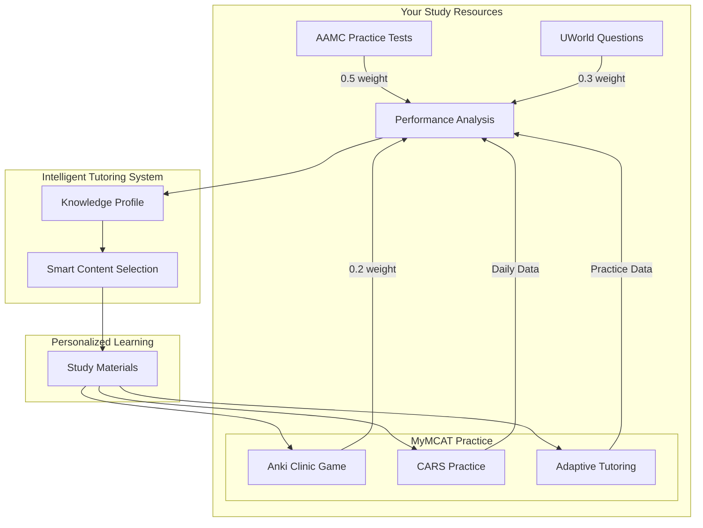

# MyMCAT System Flow Diagram

## Overview
MyMCAT operates as an intelligent tutoring system with several interconnected core components that work together to provide personalized MCAT preparation. The system uses Thompson sampling and multi-armed bandit algorithms to continuously optimize learning paths for each student.

## System Flow Diagram

## Key Components

1. **Data Collection Layer**
   - Weighted integration of multiple data sources
   - Time-stamped performance tracking
   - Source-specific reliability weighting

2. **Intelligent Tutoring Core**
   - Student Model: Tracks knowledge profiles with time decay
   - Expert Knowledge: Maps content hierarchy and relationships
   - Tutoring Module: Implements Thompson sampling for content selection

3. **Content Delivery System**
   - Adaptive content selection based on mastery levels
   - Multiple learning modalities (video, text, practice)
   - Difficulty-adjusted content pool

4. **Student Interface**
   - Interactive UI with real-time feedback
   - Calendar-based study planning
   - AI-assisted tutoring support

5. **Gamification Layer**
   - Coin-based reward system
   - Progress tracking and achievements
   - Behavioral reinforcement mechanics

The system operates as a closed feedback loop, with each component continuously updating and refining the student's learning experience.
