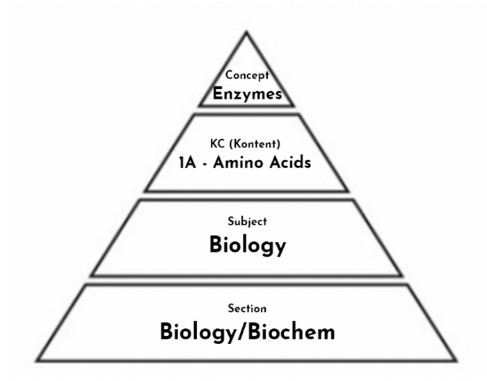
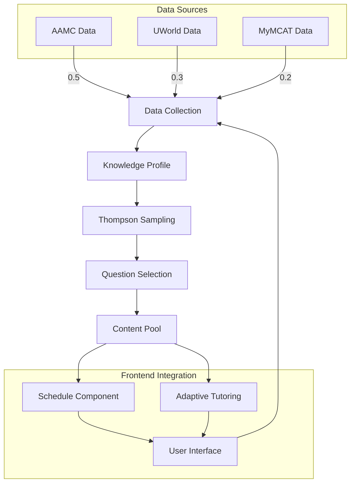
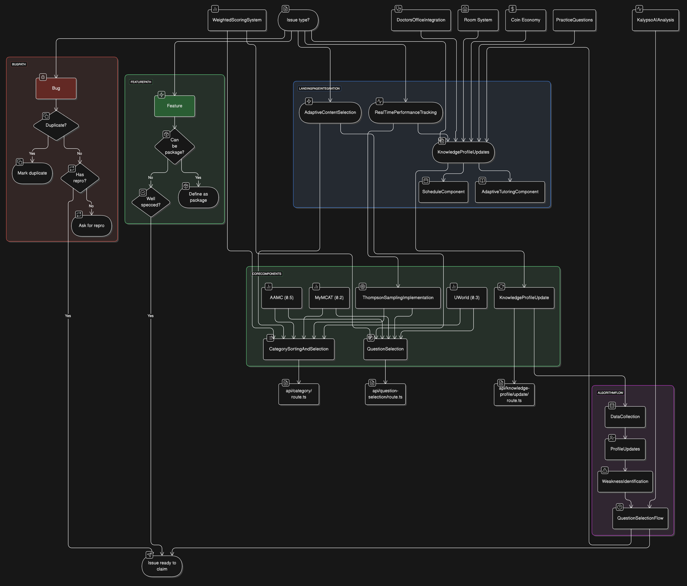

# MyMCAT Weakness Finding Algorithm Documentation

## Overview
✓ The MyMCAT Weakness Finding Algorithm is a sophisticated system that helps identify and prioritize areas where students need the most practice. Operating as a closed feedback loop, it continuously analyzes student performance across multiple sources (AAMC, UWorld, and MyMCAT) and adapts content delivery using "Thompson sampling" principles from probability theory. By treating each MCAT topic like a slot machine arm in a multi-armed bandit problem, the algorithm balances exploration of new content with exploitation of known weaknesses, while applying time-decay to ensure recent performance carries more weight. The system then uses this data to make intelligent decisions about what content to show next, much like how a skilled tutor would adjust their teaching strategy based on a student's evolving needs.

## Knowledge Hierarchy
✓ The MCAT content is organized in a hierarchical structure that allows precise tracking and targeting of student knowledge:

1. **Content Categories (CC)** - The four main MCAT sections:
   ✓ - Chemical and Physical Foundations (C/P)
   ✓ - Biological and Biochemical Foundations (B/B)
   ✓ - Psychological, Social, and Biological Foundations (P/S)
   ✓ - Critical Analysis and Reasoning Skills (CARS)

2. **Concept Categories (KC)** - More specific topics within each section, for example:
   ✓ - Under B/B: "Enzymes", "Amino Acids", "Cell Biology"
   ✓ - Under C/P: "Electricity & Magnetism", "Thermodynamics"
   ✓ - Under P/S: "Social Psychology", "Memory"



This hierarchy enables our algorithm to:
- Track mastery at multiple granularity levels
- Identify specific weaknesses within broader content areas
- Ensure comprehensive coverage across all MCAT content
- Propagate learning insights up and down the knowledge tree

## System Architecture

### 1. ITS Core Architecture

```
mermaid
graph TD
    subgraph "ITS Architecture"
        subgraph "Student Model"
            KP[Knowledge Profiles]
            TD[Time Decay]
            MW[Mastery Weights]
            KP --> TD
            TD --> MW
        end

        subgraph "Expert Knowledge"
            CC[Content Categories]
            TC[Topic Connections]
            DM[Difficulty Mapping]
            CC --> TC
            TC --> DM
        end

        subgraph "Tutoring Module"
            TS[Thompson Sampling]
            QS[Question Selection]
            AD[Adaptive Difficulty]
            TS --> QS
            QS --> AD
        end

        subgraph "Interface Module"
            UI[User Interface]
            DC[Data Collection]
            FB[Feedback System]
            UI --> DC
            DC --> FB
        end
    end

    %% Cross-module connections
    DC --> KP
    MW --> TS
    DM --> QS
    AD --> UI

    %% Data flow
    FB --> |Performance Data| KP
    TC --> |Content Structure| TS
    MW --> |Mastery Info| QS
    ```

### 2. Frontend Integration Flow


The first diagram shows the complete internal architecture of our Intelligent Tutoring System, while the second diagram illustrates how this system integrates with our frontend components and data sources.

## Architecture Diagram
Made with https://eraser.io



## Landing Page Integration
The landing page (`app/(dashboard)/(routes)/home/page.tsx`) integrates with the weakness algorithm through three primary pathways:

❌ 1. **Knowledge Profile Updates**
   - Triggered during page initialization
   - Checks if profile update is needed via `shouldUpdateKnowledgeProfiles()`
   - Updates through `/api/knowledge-profile/update` endpoint

❌ 2. **Adaptive Content Selection**
   - Active during component rendering
   - Influences content shown in `<Schedule>` and `<AdaptiveTutoring>` components
   - Determines practice recommendations

❌ 3. **Real-time Performance Tracking**
   - Monitors user interactions
   - Updates `mastery` scores
   - Adjusts content difficulty

## Core Components

### 1. Knowledge Profile Update ✓
Located in `api/knowledge-profile/update/route.ts`
✓ - Handles student mastery level updates
✓ - Implements weighted scoring system:
  ✓ - `AAMC`: 0.5 weight
  ✓ - `UWorld`: 0.3 weight
  ✓ - `MyMCAT`: 0.2 weight
✓ - Features time decay for older responses
✓ - Calculates dual mastery types:
  ✓ - `conceptMastery` (specific topics)
  ✓ - `contentMastery` (broader categories)

### 2. Category Sorting and Selection ✓
Located in `api/category/route.ts`
✓ - Determines topic prioritization
✓ - Implements sorting logic for weaknesses
✓ - Handles new material prioritization
✓ - Uses `contentMastery` for rankings
✓ - Manages topic completion filtering

### 3. Question Selection ✓
Located in `api/question-selection/route.ts`
✓ - Implements core selection algorithm
✓ - Considers multiple weighted factors:
  ✓ - `incorrectAnswerPatterns`
  ✓ - `masteryLevels`
  ✓ - `topicDifficulty`
  ✓ - `testingFrequency`
  ✓ - `historicalPerformance`

### 4. Thompson Sampling Implementation ✓
Located in `api/uworld/update/route.ts`
✓ - Manages exploration/exploitation balance
✓ - Implements `betaDistribution`
✓ - Uses `laplaceSmoothing`
✓ - Handles topic selection sampling

## The Algorithm Flow

### 1. Data Collection
- Aggregates multi-source responses
- Applies `sourceSpecificWeighting`
- Tracks `knowledgeDecay` patterns

### 2. Profile Updates
- Updates `masteryMetrics`
- Implements `timeDecay`
- Normalizes across sources

### 3. Weakness Identification
- Utilizes `thompsonSampling`
- Prioritizes weak areas
- Balances historical and recent data

### 4. Question Selection
- Combines multiple factors
- Uses `probabilityWeighting`
- Ensures comprehensive coverage

## Key Features

### 1. Multi-Source Integration ✓
✓ - Combines various data sources
✓ - Implements `reliabilityWeighting`
✓ - Normalizes across platforms

### 2. Time-Based Decay ✓
✓ - Reduces old response impact
✓ - Prioritizes recent performance
✓ - Adjusts `masteryDynamically`

### 3. Adaptive Difficulty ❌
❌ - Balances topic exploration
❌ - Uses `thompsonSampling`
❌ - Adapts to performance

### 4. Hierarchical Knowledge Model ✓
✓ - Tracks multiple mastery levels
✓ - Implements `hierarchyPropagation`
✓ - Ensures complete coverage

## Implementation Notes

### Trigger Points ❌
❌ - Regular profile updates
❌ - Practice module interactions
❌ - Tutoring session adaptations

### Configuration Parameters ✓
✓ - `sourceWeightDefinitions`
✓ - `decayFactorSettings`
✓ - `samplingParameters`
✓ - `masteryThresholds`

### Performance Optimization ❌
❌ - `masteryScore` caching
❌ - Profile update batching
❌ - Efficient sampling methods

### Future Enhancements
❌ - Dynamic weight adjustment
❌ - Enhanced decay modeling
❌ - Advanced exploration strategies

For detailed implementation specifics, refer to the blog post `weakness-finding-algorithm.mdx` which covers the casino/slot machine analogy and Thompson sampling practical applications. 