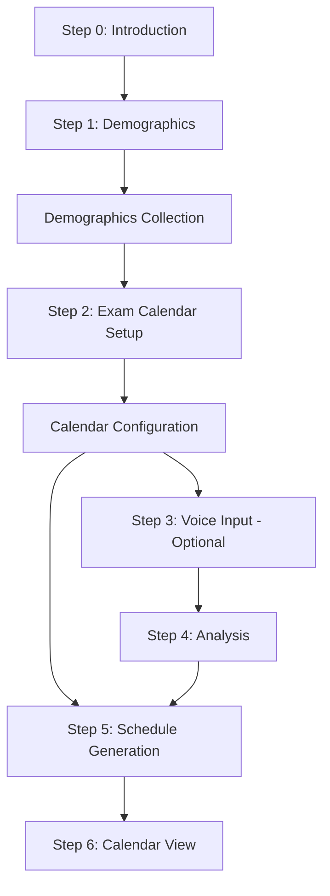

# KalypsoOnboarding Component Documentation

## Overview

The `KalypsoOnboarding.tsx` component is a comprehensive onboarding experience for MyMCAT.ai that introduces users to the platform through an interactive chat interface with "Kalypso," an AI character. This component guides users through a multi-step setup process to personalize their MCAT study experience.

## Purpose

- **User Introduction**: Welcome new users to the MyMCAT.ai platform
- **Data Collection**: Gather user demographics and study preferences
- **Exam Schedule Setup**: Configure exam dates, study hours, and full-length exam preferences
- **Personalization**: Create customized study plans based on user input
- **Engagement**: Provide an interactive, friendly onboarding experience

## Component Structure

### Props Interface
```typescript
interface KalypsoOnboardingProps {
  isOpen: boolean;           // Controls modal visibility
  onClose: () => void;       // Callback for closing the modal
  onComplete: (showCoinReward?: boolean) => void; // Callback when onboarding completes
}
```

## Core Features

### 1. Multi-Step Process
The onboarding follows a 7-step process:

| Step | Title | Purpose | Audio File |
|------|-------|---------|------------|
| 0 | Introduction | Welcome and introduction to Kalypso | `/audio/KOnboarding1.mp3` |
| 1 | Demographics | Collect user information | `/audio/KOnboarding2.mp3` |
| 2 | Exam Calendar Setup | Configure exam dates and study schedule | `/audio/KOnboarding2.mp3` |
| 3 | Voice Input | Record user struggles (optional) | `/kalypso/KalypsoVoiceStruggle.mp3` |
| 4 | Analysis | Analyze user input | `/kalypso/KalypsoVoiceAnalysis.mp3` |
| 5 | Schedule Generation | Create study plan | `/kalypso/KalypsoVoice3.mp3` |
| 6 | Calendar View | Show final schedule | `/kalypso/KalypsoVoiceStudySchedule.mp3` |

### 2. Voice Integration
- **Audio Playback**: Each step includes Kalypso's voice narration
- **Voice Recording**: Users can record their study struggles
- **Audio Management**: Prevents overlapping audio playback

### 3. Dynamic Content Rendering
The component conditionally renders different sub-components based on the current state:
- `DemographicsStep`: Collects user information
- `ExamCalendarSetup`: Configures exam dates, study hours, and full-length exam preferences
- `VoiceRecorder`: Records user input about struggles
- `AnalysisDisplay`: Shows analysis of user input
- `ScheduleGenerator`: Creates personalized study schedule
- `CalendarView`: Displays final calendar

## State Management

### Primary State Variables
```typescript
const [currentStep, setCurrentStep] = useState(0);
const [isCompleting, setIsCompleting] = useState(false);
const [kalypsoMessage, setKalypsoMessage] = useState('');
const [showKalypsoChat, setShowKalypsoChat] = useState(false);
const [showExamCalendarSetup, setShowExamCalendarSetup] = useState(false);
const [showVoiceInput, setShowVoiceInput] = useState(false);
const [skippedDiagnostic, setSkippedDiagnostic] = useState(false);
const [showAnalysis, setShowAnalysis] = useState(false);
const [showScheduleGeneration, setShowScheduleGeneration] = useState(false);
const [showFinalCalendar, setShowFinalCalendar] = useState(false);
const [showDemographics, setShowDemographics] = useState(false);
```

### State Flow


## Key Functions

### Audio Management
```typescript
const playKalypsoVoice = useCallback((audioFile: string) => {
  // Prevents overlapping audio playback
  // Creates audio element with 70% volume
  // Manages audio state with refs
}, []);
```

### Step Navigation
```typescript
const handleStepAction = useCallback(async () => {
  // Handles progression through onboarding steps
  // Manages state transitions
  // Triggers audio playback for each step
}, [currentStep, onComplete, playKalypsoVoice, stepMessages]);
```

### Data Persistence
```typescript
const handleDemographicsComplete = useCallback(async (data) => {
  // Saves user demographic data to database via API
  // Proceeds to exam calendar setup
}, []);

const handleExamCalendarComplete = useCallback(async (result) => {
  // Handles exam calendar setup completion
  // Proceeds to voice input or skips to schedule generation
}, []);
```

## Component Dependencies

### External Components
- `KalypsoAvatar`: The animated Kalypso character
- `SettingContent`: Exam calendar configuration component
- `VoiceRecorder`: Voice input functionality
- `AnalysisDisplay`: Shows analysis results
- `ScheduleGenerator`: Creates study schedules
- `CalendarView`: Displays final calendar
- `ChatBubble`: Container for chat content
- `StepNavigation`: Navigation controls
- `DemographicsStep`: Demographics form

### Hooks & Libraries
- `useRouter` (Next.js): Navigation
- `useUserInfo`: User data management
- `useAudio`: Audio store access
- `framer-motion`: Animations
- `react-hot-toast`: Notifications

## Animation & UX

### Motion Effects
- **Fade in/out**: Smooth transitions between steps
- **Slide animations**: Content appears with upward motion
- **Staggered timing**: Delayed animations for better UX

### User Experience Features
- **Skip Options**: Users can skip voice input step
- **Audio Feedback**: Voice narration for each step
- **Progress Indication**: Step navigation shows progress
- **Responsive Design**: Works on mobile and desktop

## API Integration

### Onboarding Data Endpoint
```typescript
// PUT /api/user-info/onboarding
{
  firstName: string;
  college: string;
  isNonTraditional: boolean;
  isCanadian: boolean;
  currentMcatScore: number | null;
  hasNotTakenMCAT: boolean;
  mcatAttemptNumber: string;
  targetScore: number;
  currentStep: number;
}
```

### Study Plan Generation
The exam calendar setup integrates with the existing study plan generation API to create a comprehensive schedule based on user preferences.

## Error Handling

- **Audio Errors**: Graceful fallback when audio fails to play
- **API Errors**: Toast notifications for failed data saves
- **State Recovery**: Proper cleanup on component unmount
- **Calendar Setup Errors**: Validation and error handling for exam date configuration

## Accessibility Features

- **Reduced Motion**: Respects user's motion preferences
- **Keyboard Navigation**: Supports keyboard interactions
- **Screen Reader Support**: Semantic HTML structure
- **Audio Controls**: Volume management and playback controls

## Performance Considerations

- **Memoization**: Uses `useMemo` and `useCallback` for optimization
- **Lazy Loading**: Dynamic imports for sub-components
- **Audio Management**: Prevents memory leaks with proper cleanup
- **State Optimization**: Minimal re-renders through careful state design

## Usage Example

```typescript
import KalypsoOnboarding from './KalypsoOnboarding';

const MyComponent = () => {
  const [showOnboarding, setShowOnboarding] = useState(false);
  
  const handleComplete = (showCoinReward?: boolean) => {
    setShowOnboarding(false);
    // Handle completion logic
  };
  
  return (
    <KalypsoOnboarding
      isOpen={showOnboarding}
      onClose={() => setShowOnboarding(false)}
      onComplete={handleComplete}
    />
  );
};
```

## Future Enhancements

- **Analytics Integration**: Track user progress through onboarding
- **A/B Testing**: Test different onboarding flows
- **Internationalization**: Support multiple languages
- **Advanced Voice Features**: Speech-to-text transcription
- **Progress Persistence**: Save and resume onboarding progress
- **Enhanced Calendar Integration**: More sophisticated exam scheduling options 